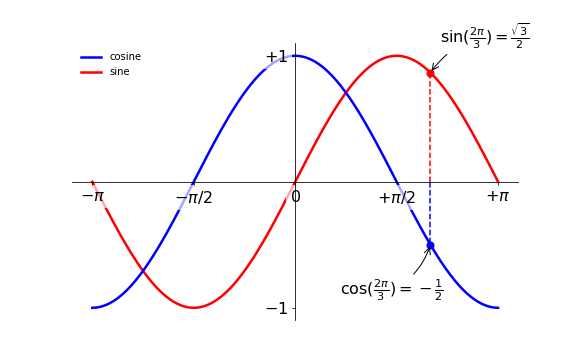
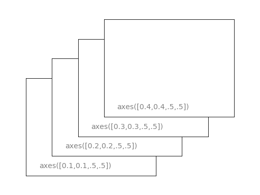
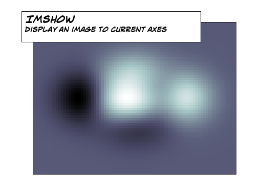
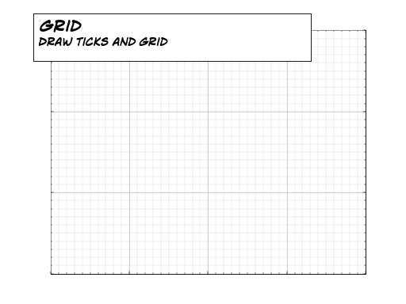

===================
Matplotlib 指南
===================

------------------------------------------------
作者 Nicolas P. Rougier 翻译 Sasasu
------------------------------------------------

.. image:: https://zenodo.org/badge/doi/10.5281/zenodo.28747.png
   :target: http://dx.doi.org/10.5281/zenodo.28747

.. contents:: Table of Contents
   :local:
   :depth: 1

源代码在此处
`github <https://github.com/rougier/matplotlib-tutorial>`_

所有的代码及素材遵守 `Creative Commons Attribution-ShareAlike 4.0 协议
<http://creativecommons.org/licenses/by-sa/4.0>`_.

本指南可在此处阅读 http://www.labri.fr/perso/nrougier/teaching/matplotlib/matplotlib.html

请一定也读一下 `为了更好的设计而生的十个简单规则(英文) <http://journals.plos.org/ploscompbiol/article?id=10.1371/journal.pcbi.1003833>`_, N.P. Rougier, M. Droettboom & P. Bourne, Plos Computational Biology 10(9): e1003833. doi:10.1371/journal.pcbi.1003833.

另请参阅:
 * `Numpy tutorial <http://www.labri.fr/perso/nrougier/teaching/numpy/numpy.html>`_
 * `100 Numpy exercices <http://www.labri.fr/perso/nrougier/teaching/numpy.100/index.html>`_

简介
============

Matplotlib大概是最常用的Pyrhon 2D绘图库。它提供从Python和其他数据里快速创建可视化图像的方法。我们将要探索matplotlib在交互模式下的常见用法。

IPython 和 pylab 模式
--------------------------

`IPython <http://ipython.org/>`_ 是一个增强的Python交互式shell,它有很多有趣的功能,包括命名输入和输出,访问shell命令,改进的调试方式和许多其他的功能。当我们使用参数 `-pylab` (IPython版本大于0.12时请使用 `--pylab` )启动后，它将允许与matplotlib会话交互并提供类似Matlab/Mathematica的功能

pyplot
------

pyplot为matplotlib提供了一个方便的面向对象的绘图接口，它的风格非常像Matlab(TM)。此外大多数pyplot的绘图命令与Matlab(TM)有着类似的参数。重要的命令将会用交互式的例子介绍

简单的图像
===========

在本章中我们将要在一个简单的画板上画一个cosine和sine函数。从默认的参数开始，我们将一步一步的完善它。
第一步是从sine和cosine函数中获取数据：

::

   import numpy as np

   X = np.linspace(-np.pi, np.pi, 256,endpoint=True)
   C,S = np.cos(X), np.sin(X)

X 现在是有着256个变量，范围为从-π 到 +π(包含)的numpy数组。
C 是 cosine 函数(256个变量)，S是 sine 函数(256个变量)。

为了演示这个例子，你可以下载每一个例子并用如下命令运行他

::

    $ python exercice_1.py

你可以点击每一步对应的图像来获取代码。

使用默认的参数来画图
--------------

.. admonition:: 文档

   * `plot 指南 <http://matplotlib.sourceforge.net/users/pyplot_tutorial.html>`_
   * `plot() 指令 <http://matplotlib.sourceforge.net/api/pyplot_api.html#matplotlib.pyplot.plot>`_

.. image:: figures/exercice_1.png
   :align: right
   :target: scripts/exercice_1.py

Matplotlib附带了一组的默认设置,允许定制各种属性。您可以控制几乎所有的属性，比如图的大小和dpi,线宽,颜色和风格,坐标轴和网格属性,文本和字体属性等等。虽然matplotlib的默认属性在大部分情况下是比较好的，但你也许为了一些特殊的场合改变某些参数。

.. include:: scripts/exercice_1.py
   :code: python
   :start-line: 4

默认实例
----------------------

.. admonition:: 文档

   *  `定制 matplotlib <http://matplotlib.sourceforge.net/users/customizing.html>`_

.. image:: figures/exercice_2.png
   :align: right
   :target: scripts/exercice_2.py

在下面的脚本中,我们将介绍所有影响图外观的参数。这些参数被显式的设定成初始值，但你现在可以交互式的改变这些参数并观察它们起得作用。(参见下面的 `线属性` 和 `线风格`)。

.. include:: scripts/exercice_2.py
   :code: python
   :start-line: 4

改变颜色和线的宽度
--------------------------------

.. admonition:: 文档

   * `控制线的属性 <http://matplotlib.sourceforge.net/users/pyplot_tutorial.html#controlling-line-properties>`_
   * `Line API <http://matplotlib.sourceforge.net/api/artist_api.html#matplotlib.lines.Line2D>`_

.. image:: figures/exercice_3.png
   :align: right
   :target: scripts/exercice_3.py

第一步，我们想要让cosine是蓝色sine是红色，并用稍微粗点的线标出他们。 我们也会稍微改变图的大小,使之更水平(horizontal)。

::

   plt.figure(figsize=(10,6), dpi=80)
   plt.plot(X, C, color="blue", linewidth=2.5, linestyle="-")
   plt.plot(X, S, color="red",  linewidth=2.5, linestyle="-")

设置边界
--------------

.. admonition:: 文档

   * `xlim() 命令 <http://matplotlib.sourceforge.net/api/pyplot_api.html#matplotlib.pyplot.xlim>`_
   * `ylim() 命令 <http://matplotlib.sourceforge.net/api/pyplot_api.html#matplotlib.pyplot.ylim>`_

.. image:: figures/exercice_4.png
   :align: right
   :target: scripts/exercice_4.py

当前的上下界对于这张图来说有点太小了，我们把他弄大点来看清楚所有的数据点。
::

   plt.xlim(X.min()*1.1, X.max()*1.1)
   plt.ylim(C.min()*1.1, C.max()*1.1)

设置坐标轴单位长度
-------------

.. admonition:: 文档

   * `xticks() 命令 <http://matplotlib.sourceforge.net/api/pyplot_api.html#matplotlib.pyplot.xticks>`_
   * `yticks() 命令 <http://matplotlib.sourceforge.net/api/pyplot_api.html#matplotlib.pyplot.yticks>`_
   * `Tick 容器 <http://matplotlib.sourceforge.net/users/artists.html#axis-container>`_
   * `坐标轴位置和格式 <http://matplotlib.sourceforge.net/api/ticker_api.html>`_

.. image:: figures/exercice_5.png
   :align: right
   :target: scripts/exercice_5.py

当前的坐标轴并不理想，因为他们不为sine和cosine显示有意义的值(+/-π,+/-π/2)，我们将改变它们，让它们只显示这些值。
::

   plt.xticks( [-np.pi, -np.pi/2, 0, np.pi/2, np.pi])
   plt.yticks([-1, 0, +1])

设置坐标轴显示单位
-------------------

.. admonition:: 文档

   * `Working with text <http://matplotlib.sourceforge.net/users/index_text.html>`_
   * `xticks() command <http://matplotlib.sourceforge.net/api/pyplot_api.html#matplotlib.pyplot.xticks>`_
   * `yticks() command <http://matplotlib.sourceforge.net/api/pyplot_api.html#matplotlib.pyplot.yticks>`_
   * `set_xticklabels() <http://matplotlib.sourceforge.net/api/axes_api.html?#matplotlib.axes.Axes.set_xticklabels>`_
   * `set_yticklabels() <http://matplotlib.sourceforge.net/api/axes_api.html?#matplotlib.axes.Axes.set_yticklabels>`_

.. image:: figures/exercice_6.png
   :align: right
   :target: scripts/exercice_6.py

现在坐标轴刻度被正确的设置了，但他们的单位并不是很明确。我们可以猜想3.142是π但让它直接显示π会更加明确。在我们设置坐标轴刻度时可以同时在第二个参数列表里提供对应的单位。注意：我们将使用LaTeX来更好的描述单位。

::

   plt.xticks([-np.pi, -np.pi/2, 0, np.pi/2, np.pi],
          [r'$-\pi$', r'$-\pi/2$', r'$0$', r'$+\pi/2$', r'$+\pi$'])

   plt.yticks([-1, 0, +1],
          [r'$-1$', r'$0$', r'$+1$'])

移动脊(Spines)
-------------

.. admonition:: 文档

   * `Spines <http://matplotlib.sourceforge.net/api/spines_api.html#matplotlib.spines>`_
   * `Axis container <http://matplotlib.sourceforge.net/users/artists.html#axis-container>`_
   * `Transformations tutorial <http://matplotlib.sourceforge.net/users/transforms_tutorial.html>`_

.. image:: figures/exercice_7.png
   :align: right
   :target: scripts/exercice_7.py

脊(Spines)是连接轴刻度和提示边界的线。它们可以被放置在任意的位置，现在它们在边界上。我们将把它放到中心。因为有四个脊（顶部/底部/左边/右边），我们将通过设置颜色为"none"来隐藏他们，同时我们将移动底部和左边的两个到坐标为0的位置。

::

   ax = plt.gca()
   ax.spines['right'].set_color('none')
   ax.spines['top'].set_color('none')
   ax.xaxis.set_ticks_position('bottom')
   ax.spines['bottom'].set_position(('data',0))
   ax.yaxis.set_ticks_position('left')
   ax.spines['left'].set_position(('data',0))

添加图例
---------------

.. admonition:: 文档

   * `Legend guide <http://matplotlib.sourceforge.net/users/legend_guide.html>`_
   * `legend() command <http://matplotlib.sourceforge.net/api/pyplot_api.html#matplotlib.pyplot.legend>`_
   * `Legend API <http://matplotlib.sourceforge.net/api/legend_api.html#matplotlib.legend.Legend>`_

.. image:: figures/exercice_8.png
   :align: right
   :target: scripts/exercice_8.py

让我们在左上角添加图例。这止血药添加一个标签关键字(它在图例框中显示)到plot命令。

::

   plt.plot(X, C, color="blue", linewidth=2.5, linestyle="-", label="cosine")
   plt.plot(X, S, color="red",  linewidth=2.5, linestyle="-", label="sine")

   plt.legend(loc='upper left', frameon=False)

添加注释点
--------------------

.. admonition:: 文档

   * `Annotating axis <http://matplotlib.sourceforge.net/users/annotations_guide.html>`_
   * `annotate() command <http://matplotlib.sourceforge.net/api/pyplot_api.html#matplotlib.pyplot.annotate>`_

.. image:: figures/exercice_9.png
   :align: right
   :target: scripts/exercice_9.py

让我们使用注解命令来注释一些有趣的点。我们选择2π/3，并想同时注释sine和cosine。我们首先在曲线上做一些标记并画一条虚线。然后使用注释命令来显示一些文本和箭头。

::

   t = 2*np.pi/3
   plt.plot([t,t],[0,np.cos(t)], color ='blue', linewidth=2.5, linestyle="--")
   plt.scatter([t,],[np.cos(t),], 50, color ='blue')

   plt.annotate(r'$\sin(\frac{2\pi}{3})=\frac{\sqrt{3}}{2}$',
                xy=(t, np.sin(t)), xycoords='data',
                xytext=(+10, +30), textcoords='offset points', fontsize=16,
                arrowprops=dict(arrowstyle="->", connectionstyle="arc3,rad=.2"))

   plt.plot([t,t],[0,np.sin(t)], color ='red', linewidth=2.5, linestyle="--")
   plt.scatter([t,],[np.sin(t),], 50, color ='red')

   plt.annotate(r'$\cos(\frac{2\pi}{3})=-\frac{1}{2}$',
                xy=(t, np.cos(t)), xycoords='data',
                xytext=(-90, -50), textcoords='offset points', fontsize=16,
                arrowprops=dict(arrowstyle="->", connectionstyle="arc3,rad=.2"))

恶魔藏在细节中(Devil is in the details)
---------------------------------------

.. admonition:: 文档

   * `Artists <http://matplotlib.sourceforge.net/api/artist_api.html>`_
   * `BBox <http://matplotlib.sourceforge.net/api/artist_api.html#matplotlib.text.Text.set_bbox>`_

因为蓝色和红色的线。坐标轴现在很难被看见。我们可以让坐标轴更大并调整他们的属性让他们有一个半透明的白色背景，这回让我们更清楚的看见坐标轴上的数据。

::

   for label in ax.get_xticklabels() + ax.get_yticklabels():
       label.set_fontsize(16)
       label.set_bbox(dict(facecolor='white', edgecolor='None', alpha=0.65 ))

图(Figures), (子坐标)Subplots, 轴(Axes) 和 Ticks
====================================================

到目前为止，我们已经使用隐式图和轴的创建(implicit figure and axes creation)来快速的绘图，但我们能通过figure, subplot, 和 axes explicitly进一步控制绘图。figures 在matplotlib代表着用户界面里的整个窗口，figures 里可以有把其他坐标限定在常规坐标里的子坐标，轴可以在图中的任意位置。根据你的意图，这都是十分有用的。我们已经在没有正式称呼使用 figures 和 subplots 的情况下使用了他们。当我们调用plot,matplotlib会调用gca()来获取当前轴(axes)，同时gca调用gcf()来获取当前figure，如果没有figure，它便会调用figure()来创建一个，严格地说是创建一个subplot(111)。让我们来看看细节。

Figures
-------

figure是一个有着“Figure #”的GUI窗口。figures从1开始编号，而不是像Python一样从0开始。这正式MATLAB风格。这是几个确定figure的样子的参数

==============  ======================= ============================================
参数             默认值                   解释
==============  ======================= ============================================
num             1                       figure的编号
figsize         figure.figsize          figure的大小(宽，高，单位英尺)
dpi             figure.dpi              每英尺内的像素点
facecolor       figure.facecolor        背景色
edgecolor       figure.edgecolor        边缘的颜色 background
frameon         True                    是否有边界
==============  ======================= ============================================

默认值可以在资源文件中指定，大部分时候都会使用默认值。只有figure的数量经常改变。

当你使用GUI可以关闭图通过点击右上角的x。但是你可以关闭图编程通过调用关闭。根据论证它关闭(1)当前图(无参数),(2)一个特定的图(图号或图实例作为参数),或(3)所有数据(所有作为参数)。
当你使用GUI时你可以通过点击右上角X来关闭figure，但你也可以编程调用函数来关闭。这取决于closes的参数，closes()将会关闭当前figure,closes(#)将会关闭特定序号的figure,closes(all)将会关闭所有figure

与其他对象一样,你可以设置图的属性与set_something方法。

Subplots
--------

通过subplots，你可以把其他坐标限定在常规坐标里。你需要指定行数和列数，注意       `gridspec <http://matplotlib.sourceforge.net/users/gridspec.html>`_ 命令是一个更强大的候选

.. image:: figures/subplot-horizontal.png
   :target: scripts/subplot-horizontal.py
.. image:: figures/subplot-vertical.png
   :target: scripts/subplot-vertical.py
.. image:: figures/subplot-grid.png
   :target: scripts/subplot-grid.py
.. image:: figures/gridspec.png
   :target: scripts/gridspec.py

Axes
----

axes非常类似于subplots，但axes允许把plots放置在figure的任何位置。所以如果我们想把一个小的坐标放在大坐标里，我们应该用axes

.. image:: figures/axes.png
   :target: scripts/axes.py

Ticks
-----

被良好格式化的坐标轴是准备发布(publishing-ready)的figures的重要的一部分。Matplotlib为坐标轴提供了一个完全可配置的系统。tick定位器(tick locators)是用来指定ticks应该在哪里出现，tick格式化器(tick formatters)则是让ticks拥有你希望的外观。主要和次要的ticks可以单独指定位置和格式化。每一个默认的次要ticks不会被显示，即使只有一个空的列表，因为他们是NullLocator(见下文)

tick定位器(Tick Locators)
..........................

这是为了应对不同需求的几种定位器:

.. list-table::
   :widths: 20 70
   :header-rows: 1

   * - Class
     - Description

   * - ``NullLocator``
     - 没有 ticks.

       .. image:: figures/ticks-NullLocator.png

   * - ``IndexLocator``
     - 在每一个点的基础上绘制一个刻度。

       .. image:: figures/ticks-IndexLocator.png

   * - ``FixedLocator``
     - Tick 的位置是固定的。

       .. image:: figures/ticks-FixedLocator.png

   * - ``LinearLocator``
     - 每隔一个间隔放置一个 Tick

       .. image:: figures/ticks-LinearLocator.png

   * - ``MultipleLocator``
     - 每隔单位间隔放置一个 Tick

       .. image:: figures/ticks-MultipleLocator.png

   * - ``AutoLocator``
     - Select no more than n intervals at nice locations.

       .. image:: figures/ticks-AutoLocator.png

   * - ``LogLocator``
     - Determine the tick locations for log axes.

       .. image:: figures/ticks-LogLocator.png

所有的定位器都是从基类matplotlib.ticker.Locator派生。你可以自己制作定位器。使用ticker来处理日期数据可能尤为棘手。因此，matplotlib在matplotlib.dates里提供特殊的定位器。

Animation
=========

在很长的一段时间里，动画在matplotlib并不是一件容易的事，完成动画需要高超的hacks技巧。但1.1版本提供了一些工具来使创造动画变得非常直观。现在能以各种方式来保存动画(但不要指望以60fps来运行非常复杂的动画)

.. admonition:: 文档

   *  See `Animation <http://matplotlib.org/api/animation_api.html>`_

在matolotlib中制作动画的最简单的方法是声明一个FuncAnimation对象，FuncAnimation对象可以告知matplotlib那个数字或那个函数需要更新，使用什么函数来更新和每个帧之间的间隔。

雨滴
---------

这是一个非常简单的雨滴效果，它可以通过把一个正在长大的小环通过一个随机数放在figure上获得。当然，它们不会一支生长，因为波的生存时间是有限的。为了模拟这一点，随着环的增长，我们可以使用一个越来越透明的颜色，知道这个环变得不可以看见。当环不可见时我们便删除这个环之后创建一个新的。

第一步是创建一个空白figure:

.. code:: python

   # New figure with white background
   fig = plt.figure(figsize=(6,6), facecolor='white')

   # New axis over the whole figure, no frame and a 1:1 aspect ratio
   ax = fig.add_axes([0,0,1,1], frameon=False, aspect=1)

Next, we need to create several rings. For this, we can use the scatter plot object that is generally used to visualize points cloud, but we can also use it to draw rings by specifying we don't have a facecolor.
We have also to take care of initial size and color for each ring such that we have all size between a minimum and a maximum size and also to make sure the largest ring is  lmost transparent.
接下来，我们需要创建几个环。为此，我们可以使用散点图的应用，通常用于可视化的点云，但我们也可以用它来绘制环通过指定我们没有facecolor。
我们还为每个环等，我们有一个最小值与最大值的大小和之间的所有尺寸以确保最大的环是几乎透明的照顾的初始大小和颜色。

接下来，我们需要创建几个环，为此，我们可以使用散点图(scatter plot)。散点图通常用于可视化大量的点，但我们也可以使用它来画我们的水滴，只要我们指明说不需要背景色(facecolors).我们还需要注意每个环的初始大小和颜色，这样所有的大小

.. image:: figures/rain-static.png
   :target: scripts/rain-static.py
   :align: right

.. code:: python

   # Number of ring
   n = 50
   size_min = 50
   size_max = 50*50

   # Ring position
   P = np.random.uniform(0,1,(n,2))

   # Ring colors
   C = np.ones((n,4)) * (0,0,0,1)
   # Alpha color channel goes from 0 (transparent) to 1 (opaque)
   C[:,3] = np.linspace(0,1,n)

   # Ring sizes
   S = np.linspace(size_min, size_max, n)

   # Scatter plot
   scat = ax.scatter(P[:,0], P[:,1], s=S, lw = 0.5,
                     edgecolors = C, facecolors='None')

   # Ensure limits are [0,1] and remove ticks
   ax.set_xlim(0,1), ax.set_xticks([])
   ax.set_ylim(0,1), ax.set_yticks([])

Now, we need to write the update function for our animation. We know that at
each time step each ring should grow be more transparent while largest ring
should be totally transparent and thus removed. Of course, we won't actually
remove the largest ring but re-use it to set a new ring at a new random
position, with nominal size and color. Hence, we keep the number of ring
constant.

.. image:: figures/rain.gif
   :target: scripts/rain-dynamic.py
   :align: right

.. code:: python

   def update(frame):
       global P, C, S

       # Every ring is made more transparent
       C[:,3] = np.maximum(0, C[:,3] - 1.0/n)

       # Each ring is made larger
       S += (size_max - size_min) / n

       # Reset ring specific ring (relative to frame number)
       i = frame % 50
       P[i] = np.random.uniform(0,1,2)
       S[i] = size_min
       C[i,3] = 1

       # Update scatter object
       scat.set_edgecolors(C)
       scat.set_sizes(S)
       scat.set_offsets(P)

       # Return the modified object
       return scat,

Last step is to tell matplotlib to use this function as an update function for
the animation and display the result or save it as a movie:

.. code:: python

   animation = FuncAnimation(fig, update, interval=10, blit=True, frames=200)
   # animation.save('rain.gif', writer='imagemagick', fps=30, dpi=40)
   plt.show()

Earthquakes
-----------

We'll now use the rain animation to visualize earthquakes on the planet from
the last 30 days. The USGS Earthquake Hazards Program is part of the National
Earthquake Hazards Reduction Program (NEHRP) and provides several data on their
`website <http://earthquake.usgs.gov>`_. Those data are sorted according to
earthquakes magnitude, ranging from significant only down to all earthquakes,
major or minor. You would be surprised by the number of minor earthquakes
happening every hour on the planet. Since this would represent too much data
for us, we'll stick to earthquakes with magnitude > 4.5. At the time of writing,
this already represent more than 300 earthquakes in the last 30 days.

First step is to read and convert data. We'll use the `urllib` library that
allows to open and read remote data. Data on the website use the `CSV` format
whose content is given by the first line::

  time,latitude,longitude,depth,mag,magType,nst,gap,dmin,rms,net,id,updated,place,type
  2015-08-17T13:49:17.320Z,37.8365,-122.2321667,4.82,4.01,mw,...
  2015-08-15T07:47:06.640Z,-10.9045,163.8766,6.35,6.6,mwp,...

We are only interested in latitude, longitude and magnitude and we won't parse
time of event (ok, that's bad, feel free to send me a PR).

.. code:: python

   import urllib
   from mpl_toolkits.basemap import Basemap

   # -> http://earthquake.usgs.gov/earthquakes/feed/v1.0/csv.php
   feed = "http://earthquake.usgs.gov/earthquakes/feed/v1.0/summary/"

   # Significant earthquakes in the last 30 days
   # url = urllib.urlopen(feed + "significant_month.csv")

   # Magnitude > 4.5
   url = urllib.urlopen(feed + "4.5_month.csv")

   # Magnitude > 2.5
   # url = urllib.urlopen(feed + "2.5_month.csv")

   # Magnitude > 1.0
   # url = urllib.urlopen(feed + "1.0_month.csv")

   # Reading and storage of data
   data = url.read().split('\n')[+1:-1]
   E = np.zeros(len(data), dtype=[('position',  float, 2),
                                  ('magnitude', float, 1)])

   for i in range(len(data)):
       row = data[i].split(',')
       E['position'][i] = float(row[2]),float(row[1])
       E['magnitude'][i] = float(row[4])

Now, we need to draw earth on a figure to show precisely where the earthquake
center is and to translate latitude/longitude in some coordinates matplotlib
can handle. Fortunately, there is the `basemap
<http://matplotlib.org/basemap/>`_ project (that tends to be replaced by the
more complete `cartopy <http://scitools.org.uk/cartopy/>`_) that is really
simple to install and to use. First step is to define a projection to draw the
earth onto a screen (there exists many different projections) and we'll stick
to the `mill` projection which is rather standard for non-specialist like me.

.. code:: python

   fig = plt.figure(figsize=(14,10))
   ax = plt.subplot(1,1,1)

   earth = Basemap(projection='mill')

Next, we request to draw coastline and fill continents:

.. code:: python

   earth.drawcoastlines(color='0.50', linewidth=0.25)
   earth.fillcontinents(color='0.95')

The `earth` object will also be used to translate coordinate quite
automatically. We are almost finished. Last step is to adapt the rain code and
put some eye candy:

.. code:: python

   P = np.zeros(50, dtype=[('position', float, 2),
                            ('size',     float, 1),
                            ('growth',   float, 1),
                            ('color',    float, 4)])
   scat = ax.scatter(P['position'][:,0], P['position'][:,1], P['size'], lw=0.5,
                     edgecolors = P['color'], facecolors='None', zorder=10)

   def update(frame):
       current = frame % len(E)
       i = frame % len(P)

       P['color'][:,3] = np.maximum(0, P['color'][:,3] - 1.0/len(P))
       P['size'] += P['growth']

       magnitude = E['magnitude'][current]
       P['position'][i] = earth(*E['position'][current])
       P['size'][i] = 5
       P['growth'][i]= np.exp(magnitude) * 0.1

       if magnitude < 6:
           P['color'][i]    = 0,0,1,1
       else:
           P['color'][i]    = 1,0,0,1
       scat.set_edgecolors(P['color'])
       scat.set_facecolors(P['color']*(1,1,1,0.25))
       scat.set_sizes(P['size'])
       scat.set_offsets(P['position'])
       return scat,

   animation = FuncAnimation(fig, update, interval=10)
   plt.show()

If everything went well, you should obtain something like this (with animation):

.. image:: figures/earthquakes.png
   :target: scripts/earthquakes.py
   :width: 50%

Other Types of Plots
====================

.. image:: figures/plot.png
   :target: `Regular Plots`_

.. image:: figures/scatter.png
   :target: `Scatter Plots`_

.. image:: figures/bar.png
   :target: `Bar Plots`_

.. image:: figures/contour.png
   :target: `Contour Plots`_

.. image:: figures/quiver.png
   :target: `Quiver Plots`_

.. image:: figures/pie.png
   :target: `Pie Charts`_

.. image:: figures/multiplot.png
   :target: `Multi Plots`_

.. image:: figures/polar.png
   :target: `Polar Axis`_

.. image:: figures/plot3d.png
   :target: `3D Plots`_

.. image:: figures/text.png
   :target: `Text`_

Regular Plots
-------------

.. image:: figures/plot_ex.png
   :align: right
   :target: scripts/plot_ex.py

.. admonition:: Hints

   You need to use the `fill_between
   <http://matplotlib.sourceforge.net/api/pyplot_api.html#matplotlib.pyplot.fill_between>`_
   command.

Starting from the code below, try to reproduce the graphic on the right taking
care of filled areas::

   import numpy as np
   import matplotlib.pyplot as plt

   n = 256
   X = np.linspace(-np.pi,np.pi,n,endpoint=True)
   Y = np.sin(2*X)

   plt.plot (X, Y+1, color='blue', alpha=1.00)
   plt.plot (X, Y-1, color='blue', alpha=1.00)
   plt.show()

Click on figure for solution.

Scatter Plots
-------------

.. image:: figures/scatter_ex.png
   :align: right
   :target: scripts/scatter_ex.py

.. admonition:: Hints

   Color is given by angle of (X,Y).

Starting from the code below, try to reproduce the graphic on the right taking
care of marker size, color and transparency.

::

   import numpy as np
   import matplotlib.pyplot as plt

   n = 1024
   X = np.random.normal(0,1,n)
   Y = np.random.normal(0,1,n)

   plt.scatter(X,Y)
   plt.show()

Click on figure for solution.

Bar Plots
---------

.. image:: figures/bar_ex.png
   :align: right
   :target: scripts/bar_ex.py

.. admonition:: Hints

   You need to take care of text alignment.

Starting from the code below, try to reproduce the graphic on the right by
adding labels for red bars.

::

   import numpy as np
   import matplotlib.pyplot as plt

   n = 12
   X = np.arange(n)
   Y1 = (1-X/float(n)) * np.random.uniform(0.5,1.0,n)
   Y2 = (1-X/float(n)) * np.random.uniform(0.5,1.0,n)

   plt.bar(X, +Y1, facecolor='#9999ff', edgecolor='white')
   plt.bar(X, -Y2, facecolor='#ff9999', edgecolor='white')

   for x,y in zip(X,Y1):
       plt.text(x+0.4, y+0.05, '%.2f' % y, ha='center', va= 'bottom')

   plt.ylim(-1.25,+1.25)
   plt.show()

Click on figure for solution.

Contour Plots
-------------

.. image:: figures/contour_ex.png
   :align: right
   :target: scripts/contour_ex.py

.. admonition:: Hints

   You need to use the `clabel
   <http://matplotlib.sourceforge.net/api/pyplot_api.html#matplotlib.pyplot.clabel>`_
   command.

Starting from the code below, try to reproduce the graphic on the right taking
care of the colormap (see `Colormaps`_ below).

::

   import numpy as np
   import matplotlib.pyplot as plt

   def f(x,y): return (1-x/2+x**5+y**3)*np.exp(-x**2-y**2)

   n = 256
   x = np.linspace(-3,3,n)
   y = np.linspace(-3,3,n)
   X,Y = np.meshgrid(x,y)

   plt.contourf(X, Y, f(X,Y), 8, alpha=.75, cmap='jet')
   C = plt.contour(X, Y, f(X,Y), 8, colors='black', linewidth=.5)
   plt.show()

Click on figure for solution.

Imshow
------

.. image:: figures/imshow_ex.png
   :align: right
   :target: scripts/imshow_ex.py

.. admonition:: Hints

   You need to take care of the ``origin`` of the image in the imshow command and
   use a `colorbar
   <http://matplotlib.sourceforge.net/api/pyplot_api.html#matplotlib.pyplot.colorbar>`_

Starting from the code below, try to reproduce the graphic on the right taking
care of colormap, image interpolation and origin.

::

   import numpy as np
   import matplotlib.pyplot as plt

   def f(x,y): return (1-x/2+x**5+y**3)*np.exp(-x**2-y**2)

   n = 10
   x = np.linspace(-3,3,4*n)
   y = np.linspace(-3,3,3*n)
   X,Y = np.meshgrid(x,y)
   plt.imshow(f(X,Y))
   plt.show()

Click on figure for solution.

Pie Charts
----------

.. image:: figures/pie_ex.png
   :align: right
   :target: scripts/pie_ex.py

.. admonition:: Hints

   You need to modify Z.

Starting from the code below, try to reproduce the graphic on the right taking
care of colors and slices size.

::

   import numpy as np
   import matplotlib.pyplot as plt

   n = 20
   Z = np.random.uniform(0,1,n)
   plt.pie(Z)
   plt.show()

Click on figure for solution.

Quiver Plots
------------

.. image:: figures/quiver_ex.png
   :align: right
   :target: scripts/quiver_ex.py

.. admonition:: Hints

   You need to draw arrows twice.

Starting from the code above, try to reproduce the graphic on the right taking
care of colors and orientations.

::

   import numpy as np
   import matplotlib.pyplot as plt

   n = 8
   X,Y = np.mgrid[0:n,0:n]
   plt.quiver(X,Y)
   plt.show()

Click on figure for solution.

Grids
-----

.. image:: figures/grid_ex.png
   :align: right
   :target: scripts/grid_ex.py

Starting from the code below, try to reproduce the graphic on the right taking
care of line styles.

::

   import numpy as np
   import matplotlib.pyplot as plt

   axes = gca()
   axes.set_xlim(0,4)
   axes.set_ylim(0,3)
   axes.set_xticklabels([])
   axes.set_yticklabels([])

   plt.show()

Click on figure for solution.

Multi Plots
-----------

.. image:: figures/multiplot_ex.png
   :align: right
   :target: scripts/multiplot_ex.py

.. admonition:: Hints

   You can use several subplots with different partition.

Starting from the code below, try to reproduce the graphic on the right.

::

   import numpy as np
   import matplotlib.pyplot as plt

   plt.subplot(2,2,1)
   plt.subplot(2,2,3)
   plt.subplot(2,2,4)

   plt.show()

Click on figure for solution.

Polar Axis
----------

.. image:: figures/polar_ex.png
   :align: right
   :target: scripts/polar_ex.py

.. admonition:: Hints

   You only need to modify the ``axes`` line

Starting from the code below, try to reproduce the graphic on the right.

::

   import numpy as np
   import matplotlib.pyplot as plt

   plt.axes([0,0,1,1])

   N = 20
   theta = np.arange(0.0, 2*np.pi, 2*np.pi/N)
   radii = 10*np.random.rand(N)
   width = np.pi/4*np.random.rand(N)
   bars = plt.bar(theta, radii, width=width, bottom=0.0)

   for r,bar in zip(radii, bars):
       bar.set_facecolor( cm.jet(r/10.))
       bar.set_alpha(0.5)

   plt.show()

Click on figure for solution.

3D Plots
--------

.. image:: figures/plot3d_ex.png
   :align: right
   :target: scripts/plot3d_ex.py

.. admonition:: Hints

   You need to use `contourf
   <http://matplotlib.sourceforge.net/api/pyplot_api.html#matplotlib.pyplot.contourf>`_

Starting from the code below, try to reproduce the graphic on the right.

::

   import numpy as np
   import matplotlib.pyplot as plt
   from mpl_toolkits.mplot3d import Axes3D

   fig = plt.figure()
   ax = Axes3D(fig)
   X = np.arange(-4, 4, 0.25)
   Y = np.arange(-4, 4, 0.25)
   X, Y = np.meshgrid(X, Y)
   R = np.sqrt(X**2 + Y**2)
   Z = np.sin(R)

   ax.plot_surface(X, Y, Z, rstride=1, cstride=1, cmap='hot')

   plt.show()

Click on figure for solution.

Text
----

.. image:: figures/text_ex.png
  :align: right
  :target: scripts/text_ex.py

.. admonition:: Hints

   Have a look at the `matplotlib logo
   <http://matplotlib.sourceforge.net/examples/api/logo2.html>`_.

Try to do the same from scratch !

Click on figure for solution.

Beyond this tutorial
====================

Matplotlib benefits from extensive 文档 as well as a large
community of users and developpers. Here are some links of interest:

Tutorials
---------

* `Pyplot tutorial <http://matplotlib.sourceforge.net/users/pyplot_tutorial.html>`_

  - Introduction
  - Controlling line properties
  - Working with multiple figures and axes
  - Working with text
  -

* `Image tutorial <http://matplotlib.sourceforge.net/users/image_tutorial.html>`_

  - Startup commands
  - Importing image data into Numpy arrays
  - Plotting numpy arrays as images
  -

* `Text tutorial <http://matplotlib.sourceforge.net/users/index_text.html>`_

  - Text introduction
  - Basic text commands
  - Text properties and layout
  - Writing mathematical expressions
  - Text rendering With LaTeX
  - Annotating text
  -

* `Artist tutorial <http://matplotlib.sourceforge.net/users/artists.html>`_

  - Introduction
  - Customizing your objects
  - Object containers
  - Figure container
  - Axes container
  - Axis containers
  - Tick containers
  -

* `Path tutorial <http://matplotlib.sourceforge.net/users/path_tutorial.html>`_

  - Introduction
  - Bézier example
  - Compound paths
  -

* `Transforms tutorial <http://matplotlib.sourceforge.net/users/transforms_tutorial.html>`_

  - Introduction
  - Data coordinates
  - Axes coordinates
  - Blended transformations
  - Using offset transforms to create a shadow effect
  - The transformation pipeline
  -

Matplotlib 文档
------------------------

* `User guide <http://matplotlib.sourceforge.net/users/index.html>`_

* `FAQ <http://matplotlib.sourceforge.net/faq/index.html>`_

  - Installation
  - Usage
  - How-To
  - Troubleshooting
  - Environment Variables
  -

* `Screenshots <http://matplotlib.sourceforge.net/users/screenshots.html>`_

Code 文档
------------------

The code is fairly well documented and you can quickly access a specific
command from within a python session:

::

   >>> from pylab import *
   >>> help(plot)
   Help on function plot in module matplotlib.pyplot:

   plot(*args, **kwargs)
      Plot lines and/or markers to the
      :class:`~matplotlib.axes.Axes`.  *args* is a variable length
      argument, allowing for multiple *x*, *y* pairs with an
      optional format string.  For example, each of the following is
      legal::

          plot(x, y)         # plot x and y using default line style and color
          plot(x, y, 'bo')   # plot x and y using blue circle markers
          plot(y)            # plot y using x as index array 0..N-1
          plot(y, 'r+')      # ditto, but with red plusses

      If *x* and/or *y* is 2-dimensional, then the corresponding columns
      will be plotted.
      ...

Galleries
---------

The `matplotlib gallery <http://matplotlib.sourceforge.net/gallery.html>`_ is
also incredibly useful when you search how to render a given graphic. Each
example comes with its source.

A smaller gallery is also available `here <http://www.loria.fr/~rougier/coding/gallery/>`_.

Mailing lists
--------------

Finally, there is a `user mailing list
<https://mail.python.org/mailman/listinfo/matplotlib-users>`_ where you can
ask for help and a `developers mailing list
<https://mail.python.org/mailman/listinfo/matplotlib-devel>`_ that is more
technical.

Quick references
================

Here is a set of tables that show main properties and styles.

Line properties
----------------

.. list-table::
   :widths: 20 30 50
   :header-rows: 1

   * - Property
     - Description
     - Appearance

   * - alpha (or a)
     - alpha transparency on 0-1 scale
     - .. image:: figures/alpha.png

   * - antialiased
     - True or False - use antialised rendering
     - .. image:: figures/aliased.png
       .. image:: figures/antialiased.png

   * - color (or c)
     - matplotlib color arg
     - .. image:: figures/color.png

   * - linestyle (or ls)
     - see `Line properties`_
     -

   * - linewidth (or lw)
     - float, the line width in points
     - .. image:: figures/linewidth.png

   * - solid_capstyle
     - Cap style for solid lines
     - .. image:: figures/solid_capstyle.png

   * - solid_joinstyle
     - Join style for solid lines
     - .. image:: figures/solid_joinstyle.png

   * - dash_capstyle
     - Cap style for dashes
     - .. image:: figures/dash_capstyle.png

   * - dash_joinstyle
     - Join style for dashes
     - .. image:: figures/dash_joinstyle.png

   * - marker
     - see `Markers`_
     -

   * - markeredgewidth (mew)
     - line width around the marker symbol
     - .. image:: figures/mew.png

   * - markeredgecolor (mec)
     - edge color if a marker is used
     - .. image:: figures/mec.png

   * - markerfacecolor (mfc)
     - face color if a marker is used
     - .. image:: figures/mfc.png

   * - markersize (ms)
     - size of the marker in points
     - .. image:: figures/ms.png

Line styles
-----------

.. list-table::
   :widths: 15 30 50
   :header-rows: 1

   * - Symbol
     - Description
     - Appearance

   * - ``-``
     - solid line
     - .. image:: figures/linestyle--.png

   * - ``--``
     - dashed line
     - .. image:: figures/linestyle---.png

   * - ``-.``
     - dash-dot line
     - .. image:: figures/linestyle--dot.png

   * - ``:``
     - dotted line
     - .. image:: figures/linestyle-:.png

   * - ``.``
     - points
     - .. image:: figures/linestyle-dot.png

   * - ``,``
     - pixels
     - .. image:: figures/linestyle-,.png

   * - ``o``
     - circle
     - .. image:: figures/linestyle-o.png

   * - ``^``
     - triangle up
     - .. image:: figures/linestyle-^.png

   * - ``v``
     - triangle down
     - .. image:: figures/linestyle-v.png

   * - ``<``
     - triangle left
     - .. image:: figures/linestyle-<.png

   * - ``>``
     - triangle right
     - .. image:: figures/linestyle->.png

   * - ``s``
     - square
     - .. image:: figures/linestyle-s.png

   * - ``+``
     - plus
     - .. image:: figures/linestyle-+.png

   * - ``x``
     -  cross
     - .. image:: figures/linestyle-x.png

   * - ``D``
     - diamond
     - .. image:: figures/linestyle-dd.png

   * - ``d``
     - thin diamond
     - .. image:: figures/linestyle-d.png

   * - ``1``
     - tripod down
     - .. image:: figures/linestyle-1.png

   * - ``2``
     - tripod up
     - .. image:: figures/linestyle-2.png

   * - ``3``
     - tripod left
     - .. image:: figures/linestyle-3.png

   * - ``4``
     - tripod right
     - .. image:: figures/linestyle-4.png

   * - ``h``
     - hexagon
     - .. image:: figures/linestyle-h.png

   * - ``H``
     - rotated hexagon
     - .. image:: figures/linestyle-hh.png

   * - ``p``
     -  pentagon
     - .. image:: figures/linestyle-p.png

   * - ``|``
     - vertical line
     - .. image:: figures/linestyle-|.png

   * - ``_``
     - horizontal line
     - .. image:: figures/linestyle-_.png

Markers
-------

.. list-table::
   :widths: 15 30 50
   :header-rows: 1

   * - Symbol
     - Description
     - Appearance

   * - 0
     - tick left
     - .. image:: figures/marker-i0.png

   * - 1
     - tick right
     - .. image:: figures/marker-i1.png

   * - 2
     - tick up
     - .. image:: figures/marker-i2.png

   * - 3
     - tick down
     - .. image:: figures/marker-i3.png

   * - 4
     - caret left
     - .. image:: figures/marker-i4.png

   * - 5
     - caret right
     - .. image:: figures/marker-i5.png

   * - 6
     - caret up
     - .. image:: figures/marker-i6.png

   * - 7
     - caret down
     - .. image:: figures/marker-i7.png

   * - ``o``
     - circle
     - .. image:: figures/marker-o.png

   * - ``D``
     - diamond
     - .. image:: figures/marker-dd.png

   * - ``h``
     - hexagon 1
     - .. image:: figures/marker-h.png

   * - ``H``
     - hexagon 2
     - .. image:: figures/marker-hh.png

   * - ``_``
     - horizontal line
     - .. image:: figures/marker-_.png

   * - ``1``
     - tripod down
     - .. image:: figures/marker-1.png

   * - ``2``
     - tripod up
     - .. image:: figures/marker-2.png

   * - ``3``
     - tripod left
     - .. image:: figures/marker-3.png

   * - ``4``
     - tripod right
     - .. image:: figures/marker-4.png

   * - ``8``
     - octagon
     - .. image:: figures/marker-8.png

   * - ``p``
     - pentagon
     - .. image:: figures/marker-p.png

   * - ``^``
     - triangle up
     - .. image:: figures/marker-^.png

   * - ``v``
     - triangle down
     - .. image:: figures/marker-v.png

   * - ``<``
     - triangle left
     - .. image:: figures/marker-<.png

   * - ``>``
     - triangle right
     - .. image:: figures/marker->.png

   * - ``d``
     - thin diamond
     - .. image:: figures/marker-d.png

   * - ``,``
     - pixel
     - .. image:: figures/marker-,.png

   * - ``+``
     - plus
     - .. image:: figures/marker-+.png

   * - ``.``
     - point
     - .. image:: figures/marker-dot.png

   * - ``s``
     - square
     - .. image:: figures/marker-s.png

   * - ``*``
     - star
     - .. image:: figures/marker-*.png

   * - ``|``
     - vertical line
     - .. image:: figures/marker-|.png

   * - ``x``
     - cross
     - .. image:: figures/marker-x.png

   * - ``r'$\sqrt{2}$'``
     - any latex expression
     - .. image:: figures/marker-latex.png

Colormaps
---------

All colormaps can be reversed by appending ``_r``. For instance, ``gray_r`` is
the reverse of ``gray``.

If you want to know more about colormaps, checks `Documenting the matplotlib
colormaps <https://gist.github.com/2719900>`_.

Base
....

.. list-table::
   :widths: 30 70
   :header-rows: 1

   * - Name
     - Appearance

   * - autumn
     - .. image:: figures/cmap-autumn.png

   * - bone
     - .. image:: figures/cmap-bone.png

   * - cool
     - .. image:: figures/cmap-cool.png

   * - copper
     - .. image:: figures/cmap-copper.png

   * - flag
     - .. image:: figures/cmap-flag.png

   * - gray
     - .. image:: figures/cmap-gray.png

   * - hot
     - .. image:: figures/cmap-hot.png

   * - hsv
     - .. image:: figures/cmap-hsv.png

   * - jet
     - .. image:: figures/cmap-jet.png

   * - pink
     - .. image:: figures/cmap-pink.png

   * - prism
     - .. image:: figures/cmap-prism.png

   * - spectral
     - .. image:: figures/cmap-spectral.png

   * - spring
     - .. image:: figures/cmap-spring.png

   * - summer
     - .. image:: figures/cmap-summer.png

   * - winter
     - .. image:: figures/cmap-winter.png

GIST
....

.. list-table::
   :widths: 30 70
   :header-rows: 1

   * - Name
     - Appearance

   * - gist_earth
     - .. image:: figures/cmap-gist_earth.png

   * - gist_gray
     - .. image:: figures/cmap-gist_gray.png

   * - gist_heat
     - .. image:: figures/cmap-gist_heat.png

   * - gist_ncar
     - .. image:: figures/cmap-gist_ncar.png

   * - gist_rainbow
     - .. image:: figures/cmap-gist_rainbow.png

   * - gist_stern
     - .. image:: figures/cmap-gist_stern.png

   * - gist_yarg
     - .. image:: figures/cmap-gist_yarg.png

Sequential
..........

.. list-table::
   :widths: 30 70
   :header-rows: 1

   * - Name
     - Appearance

   * - BrBG
     - .. image:: figures/cmap-BrBG.png

   * - PiYG
     - .. image:: figures/cmap-PiYG.png

   * - PRGn
     - .. image:: figures/cmap-PRGn.png

   * - PuOr
     - .. image:: figures/cmap-PuOr.png

   * - RdBu
     - .. image:: figures/cmap-RdBu.png

   * - RdGy
     - .. image:: figures/cmap-RdGy.png

   * - RdYlBu
     - .. image:: figures/cmap-RdYlBu.png

   * - RdYlGn
     - .. image:: figures/cmap-RdYlGn.png

   * - Spectral
     - .. image:: figures/cmap-spectral-2.png

Diverging
.........

.. list-table::
   :widths: 30 70
   :header-rows: 1

   * - Name
     - Appearance

   * - Blues
     - .. image:: figures/cmap-Blues.png

   * - BuGn
     - .. image:: figures/cmap-BuGn.png

   * - BuPu
     - .. image:: figures/cmap-BuPu.png

   * - GnBu
     - .. image:: figures/cmap-GnBu.png

   * - Greens
     - .. image:: figures/cmap-Greens.png

   * - Greys
     - .. image:: figures/cmap-Greys.png

   * - Oranges
     - .. image:: figures/cmap-Oranges.png

   * - OrRd
     - .. image:: figures/cmap-OrRd.png

   * - PuBu
     - .. image:: figures/cmap-PuBu.png

   * - PuBuGn
     - .. image:: figures/cmap-PuBuGn.png

   * - PuRd
     - .. image:: figures/cmap-PuRd.png

   * - Purples
     - .. image:: figures/cmap-Purples.png

   * - RdPu
     - .. image:: figures/cmap-RdPu.png

   * - Reds
     - .. image:: figures/cmap-Reds.png

   * - YlGn
     - .. image:: figures/cmap-YlGn.png

   * - YlGnBu
     - .. image:: figures/cmap-YlGnBu.png

   * - YlOrBr
     - .. image:: figures/cmap-YlOrBr.png

   * - YlOrRd
     - .. image:: figures/cmap-YlOrRd.png

Qualitative
...........

.. list-table::
   :widths: 30 70
   :header-rows: 1

   * - Name
     - Appearance

   * - Accent
     - .. image:: figures/cmap-Accent.png

   * - Dark2
     - .. image:: figures/cmap-Dark2.png

   * - Paired
     - .. image:: figures/cmap-Paired.png

   * - Pastel1
     - .. image:: figures/cmap-Pastel1.png

   * - Pastel2
     - .. image:: figures/cmap-Pastel2.png

   * - Set1
     - .. image:: figures/cmap-Set1.png

   * - Set2
     - .. image:: figures/cmap-Set2.png

   * - Set3
     - .. image:: figures/cmap-Set3.png

Miscellaneous
.............

.. list-table::
   :widths: 30 70
   :header-rows: 1

   * - Name
     - Appearance

   * - afmhot
     - .. image:: figures/cmap-afmhot.png

   * - binary
     - .. image:: figures/cmap-binary.png

   * - brg
     - .. image:: figures/cmap-brg.png

   * - bwr
     - .. image:: figures/cmap-bwr.png

   * - coolwarm
     - .. image:: figures/cmap-coolwarm.png

   * - CMRmap
     - .. image:: figures/cmap-CMRmap.png

   * - cubehelix
     - .. image:: figures/cmap-cubehelix.png

   * - gnuplot
     - .. image:: figures/cmap-gnuplot.png

   * - gnuplot2
     - .. image:: figures/cmap-gnuplot2.png

   * - ocean
     - .. image:: figures/cmap-ocean.png

   * - rainbow
     - .. image:: figures/cmap-rainbow.png

   * - seismic
     - .. image:: figures/cmap-seismic.png

   * - terrain
     - .. image:: figures/cmap-terrain.png
